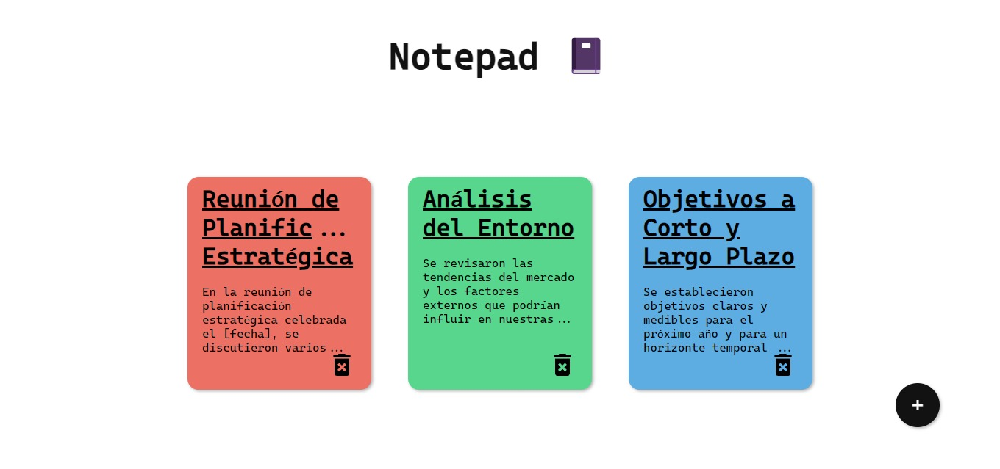
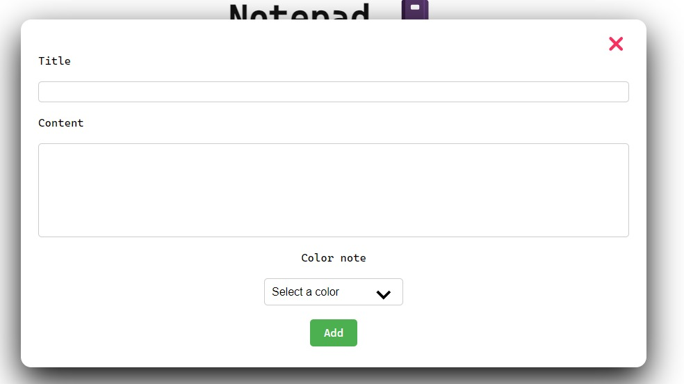
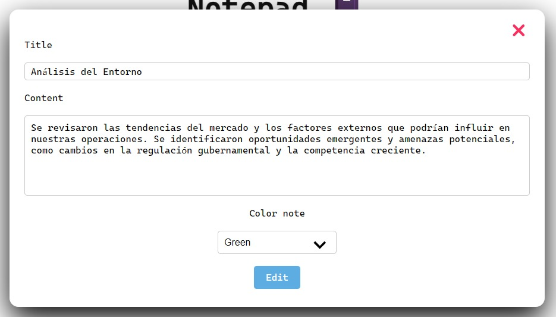
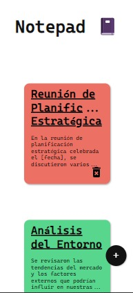

# 📝 Notepad con React y Vite

¡Bienvenido a mi proyecto de Notepad desarrollado en React con Vite! Esta aplicación te permite crear, editar y eliminar notas de una manera sencilla y elegante.

## 🎨 Características

- **Crear notas:** Utiliza el botón "+" para agregar una nueva nota. Llena el formulario con el título, contenido y color de tu elección, luego haz clic en "Agregar".
- **Editar notas:** Haz clic en una nota existente para editar su título, contenido o color.
- **Eliminar notas:** Utiliza el icono del 🗑️ en cada nota para eliminarla de tu lista.

## 🖼️ Capturas de pantalla

## 🛠️ Tecnologías utilizadas

- **React:** Utilizamos React para la interfaz de usuario dinámica y reactiva.
- **Vite:** Una herramienta de compilación rápida para aplicaciones web modernas. Nos proporciona un entorno de desarrollo rápido con recarga en caliente.
- **CSS:** Estilos personalizados para una apariencia atractiva y responsive.

## ⚙️ Instalación y Uso

1. Clona este repositorio en tu máquina local utilizando `git clone`.
2. Navega al directorio del proyecto e instala las dependencias con `npm install`.
3. Inicia la aplicación con `npm run dev`.

## 🚀 Construcción para producción

Si deseas construir la aplicación para producción, puedes usar el siguiente comando: `npm run build`

Esto generará una versión optimizada de la aplicación en el directorio `dist`.

## 💡 Contribución

¡Las contribuciones son bienvenidas! Si deseas contribuir a este proyecto, sigue estos pasos:

1. Haz un fork del repositorio.
2. Crea una nueva rama para tu funcionalidad (`git checkout -b feature/nueva-funcionalidad`).
3. Realiza tus cambios y haz commit (`git commit -am 'Agrega nueva funcionalidad'`).
4. Sube tus cambios a tu repositorio en GitHub (`git push origin feature/nueva-funcionalidad`).
5. Abre un Pull Request en este repositorio.

## 📧 Contacto

Si tienes alguna pregunta o sugerencia sobre este proyecto, no dudes en contactarme:

- Correo electrónico: programmingarmanasco@gmail.com
- LinkedIn: [Franco Armanasco](https://www.linkedin.com/in/francoarmanasco/)

¡Gracias por tu interés en mi proyecto!

